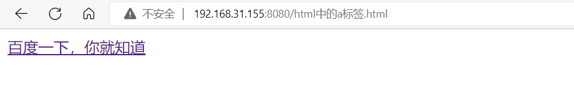

# 《HTML常用标签》
最近学习了一些关于HTML的常用标签，并在此做个博客来详细说明这些标签的具体属性以及用法，用于记录学习笔记以及检验学习成果。  
本文的主要内容有：  
1. a标签的用法
2. img标签的用法
3. table标签的用法
4. 其他感想
## a标签的用法
*HTML中的a标签又被称为锚元素，可以通过它的 href 属性创建通向其他网页、文件、同一页面内的位置、电子邮件地址或任何其他 URL 的超链接。--MDN*  
整理之后，a标签的主要作用有以下三点：  
* 跳转外部页面
* 跳转内部页面
* 跳转到邮箱或者电话等  
以下主要了解a标签的3种属性，分别是：  
* href
* target
* download
### href
href的取值有以下四种：  
* 网址
* 路径
* 伪协议
* id  
#### 网址
举一个例子来说明，如果想要点击一个标签来访问百度的地址，代码则为：  
`<a href="https://baidu.com">百度一下，你就知道</a>`

点击访问后即可进入百度一下页面。  
代码中中，href即为需要访问的网页正确地址，在两个<a>与</a>之间的即为超链接的显示互动文字。  
我们知道，在网页有两种协议，分别是HTTP和HTTPS，有时候输入错误可能会打不开相应的网页，这时候就建议用以下的方式来输入超链接网址，那就是：  
`<a href="//baidu.com">百度一下，你就知道</a>`  
采用这种方式的网址会自动选择是http还是https。
#### 路径
比如，我需要点击超链接来访问"百度一下标题"这张图片
  
我的代码就可以写成：  
`<a href="/picture/百度一下标题.png">访问图片</a>`  
点击访问图片后即可打开图片
  
其中，访问图片的路径需要是相对路径(*ps:相对路径是什么可以自行百度*)，除图片外也可以访问其他类型的文件。
#### 伪协议
伪协议是在超链接中使用，可以调用一些代码，完成特定的功能，具体的内容我暂时还不太明白，但是这里着重介绍一中伪协议：  
`<a href="JavaScript:;">空的伪协议</a>`  
此代码表示一个空的伪协议，作用是当你点击这个超链接时，你的页面不会发生任何改变（**记住是任何改变**）。
除此之外，还可以写邮箱和电话，代码样式如下：
```
<a href="mailto:你的邮箱">发邮件给xxx</a>
<a href="tel:你的电话">打电话给xxx</a>
```
点击后即可发邮件和打电话。
#### id
可以进行内部的跳转，输入需要跳转到的地方的id，点击超链接后即可跳转。
举例如下：
```html
<a href="#xxx">点击跳转至xxx</a>
1
2
...
<p id="xxx">20</p>
...
30
31
```
打开网页时，是这样的：

点击跳转后：

即可跳转至id所在位置。  
接下来介绍href的第二个属性**target**
### target
target中有一般有五种用法：
* _blank （设置后点击超链接则会在一个新窗口打开网页）
* _top （当网页中有多个含top标签的超链接，则会选择用最顶层的含有top标签的超链接页面打开新链接）
* _parent （在上一层页面打开，如果没有上一层，那打开的页面与_top相同）
* _self （在当前页面打开网页）
* 指定用于显示链接内容的名称（就是可以指定哪个窗口打开网页）  

其中需要说明一下_top属性：  
这里我建立了一个内嵌窗口，图片如下：
  
内嵌窗口中是一个百度的超链接，代码中加入了target="_top"
`<a href="//baidu.com" target="_top">我是百度</a>`  
那么问题来了，此时我点击超链接，新窗口会在哪里打开呢？
**答案是：会在最外层的窗口打开**  
如果这里target="_self"，那打开新窗口就是在红色区域打开了。  
现在还剩最后一个属性**download**
这个属性添加后，点击超链接时，会自动下载超链接中的内容，这里不做演示。
## img标签的用法
作用：发出get请求，展示一张图片  
属性：alt/height/width/src  
事件：onload/onerror
响应式：max-width:100%
### img属性
#### alt
alt表示可选的，可替换的，输入后表示当图片加载错误时，显示alt中的内容。  
``表示图片显示错误时，显示"一个帅哥"

#### height/width
height表示图片高度，width表示图片宽度。一般只需要设置其中一项属性即可，如果两个都设置会导致图片的比例变得奇怪。这里补充一个作为前端工程师的底线：  
**不要让图片变形**
#### src
表示图片的源地址，或者是路径，这里不必多说与前面的href一样。
### onload/onerror事件
onload/onerror可以监听图片的事件，若图片加载成功，则为onload，若失败则为onerror。
下面写一段代码：  
```html

    <script>
      xxx.onload = function () {
        console.log("图片加载成功");
      };
      xxx.onerror = function () {
        console.log("图片加载失败");
```
若hhhhhhh.jpg加载成功，则会有：

若加载失败则会有：  

当失败的时候，可以对失败图片进行挽救，只需要在onerror中添加这个：
```html
 xxx.onerror = function () {
console.log("图片加载失败");
xxx.src = "挽救的图片路径";
该行代码即为挽救, 当图片加载不出来的时候, 加载这张图片;
};
```  
输入后，即可以在图片加载失败后，显示挽救的图片。
那么就有聪明的小伙伴问了，如果挽救的图片也加载不出来怎么办呢？  
**那你就不能保证这张图片加载成功吗？？？**
### 响应式页面
主要用于做手机页面，在开头style中写上：
```html
<style>
      * {
        margin: 0;
        padding: 0;
        box-sizing: border-box;
      }
      img {
        max-width: 100%;
      }
</style>
```
该设置了页边距：0，内边距：0，本页面处在该页面的宽度内  
设置最大宽度：100%，即可图片随着手机页面放大缩小也会随着会放大缩小  
主要是在手机页面做网页，能正常显示图片大小。
## table标签的用法
table是html中的表格标签，用于制作网页中的表格。
table中有以下几种属性:
* thead 表格的头部区域
* tbody 表格主体
* tfoot 表格尾部
* tr 表示表格中的一行
* th 表示加粗的数据
* td 表示不加粗的普通数据
举个例子，下面做一个姓名与爱好的表格，代码如下：
```html
<table>
      <thead>
        <tr>
          <th>姓名</th><th>爱好</th>
        </tr>
      </thead>
      <tbody>
        <tr>
          <td>小明</td><td>唱歌</td>
        </tr>
        <tr>
          <td>小红</td><td>跳舞</td>
        </tr>
        <tr>
          <td>小白</td><td>rap</td>
        </tr>
        <tr>
          <td>小坤</td><td>篮球</td>
        </tr>
      </tbody>
    </table>
```
效果如下：
  
如果是二维表格呢？只需要在第一行第一列加个空就行：
```html
<table>
      <thead>
        <tr>
          <th></th>
          <th>姓名</th>
          <th>爱好</th>
        </tr>
      </thead>
      <tbody>
        <tr>
          <th>1</th><td>小明</td><td>唱歌</td>
        </tr>
        <tr>
          <th>2</th><td>小红</td><td>跳舞</td>
        </tr>
        <tr>
          <th>3</th><td>小白</td><td>rap</td>
        </tr>
        <tr>
          <th>4</th><td>小坤</td><td>篮球</td>
        </tr>
      </tbody>
    </table>
```
这样呈现出来的效果是这样的：

若不写tbody，直接写th和td，则html的超强纠错会直接把你写的内容嵌套在tbody里面  
代码中thead，tbody，tfoot三个标签和顺序无关。
### table的相关样式
table常见样式有：
* table-layout
* border-collapse
* border-spacing
#### table-layout
一般有两种设置属性：
```html
<style>
      table {
        table-layout: auto;
        table-layout: fixed;
      }
    </style>
```
auto表示设置后，表格的宽度由表格中的内容决定，各列各行分布不均  
fixed表示设置后，表格宽度一致，由设置的表格宽度来决定。
#### border-collapse
设置表格的边框样式，这里不做说明，可以设置边框的宽度，颜色，边框样式等。
#### border-spacing
设置表格中的间隔大小，比如border-spacing：10px；就是设置边框间隔10个像素。
## 其他感想
这篇的博客也是花了五六个小时编辑完了，其中肯定也有些说不对的地方，但是用法应该是没错了，目前的阶段还是需要多多练习，熟练使用html的相关语法，尽量使每个语法都写对，然后就可以开始学习CSS的相关内容了。